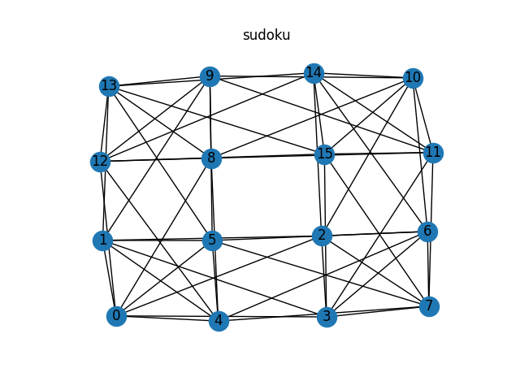
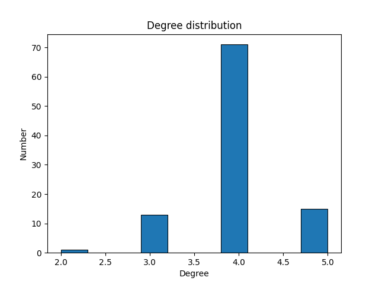
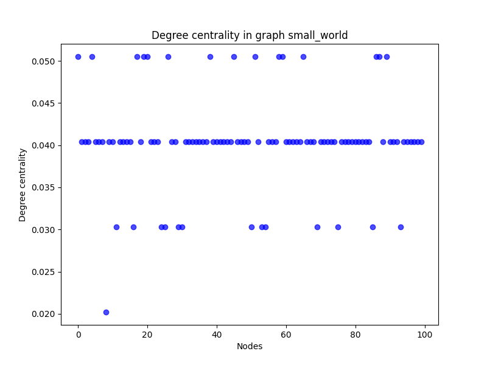
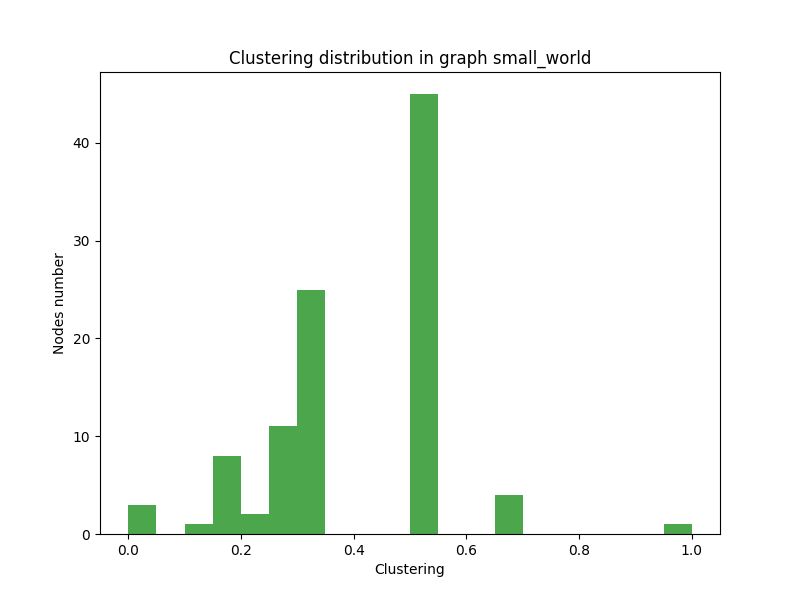

# random_graphs_analysis

## Description of project

This project's goal is to generate and compare some kinds of graphs.

The graph types so far:
* random
* scale_free
* small_world
* binomial_tree
* mycielski
* sudoku

Graphs are generate with **networkx** and are visualise with **matplotlib**.

 _Example graph_

## Description of charts

### Degree distribution
X-axis: Node number.

Y-axis: Degree of node - number of edges from the node.

 _Example degree distribution graph_

### Degree centrality
X-axis: Node number.

Y-axis: Degree centrality value (a measure from 0 to 1, proportional to the number of neighbors of the node).

 _Example degree centrality graph_

### Clustering
X-axis: Clustering coefficient values (from 0 to 1).

Y-axis: Number of nodes that have a given clustering coefficient value.

 _Example clustering graph_

